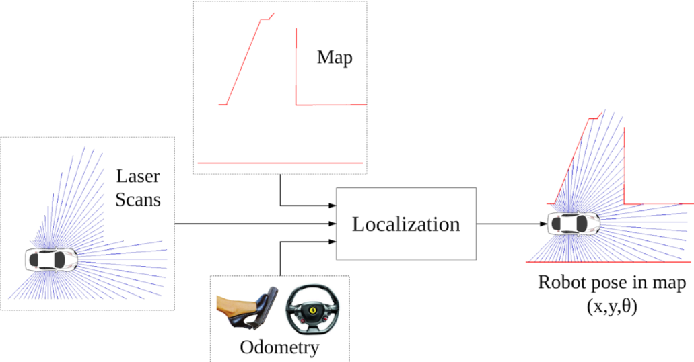

| Deliverable | Due Date              |
|---------------|----------------------------------------------------------------------------|
| Part A individual submission (gradescope) | Friday, March 21st at 11:59PM EST |
| Part B team submission (gradescope) | Monday, April 7th at 11:59PM EST |
| OPTIONAL: Parts D and E | Monday, April 7th at 11:59PM EST |
| Pushed code | Monday, April 7th at 11:59PM EST |
| Briefing (8 min presentation + 3 min Q&A) | Monday, April 7th at 1:00PM EST |
| Report (on team github pages website) | Friday, April 11th at 11:59PM EST |
| Checkoff | Wednesday, April 9th at 7:00PM EST |
| [Team Member Assessment](https://forms.gle/5NEPu4AFvtLoBeeTA) | Wednesday, April 9th at 11:59PM EST |

*Note: We will assume the lowest score if the team member assessment form is not submitted on time*

*Note: Late checkoffs will incur a percentage penalty to your participation grade. Missed checkoffs will result in -1% to your overall grade*

**notebook with detailed instructions for each module: [README.ipynb](README.ipynb)**

# Lab 5: Monte Carlo Localization (MCL)

## Introduction

Determining a robot’s orientation and position in a known environment, also known as localization, is a critical problem in the field of robotics. As is common in robotics, this seemingly simple problem is surprisingly difficult, and remains an active research area. In this lab, you will solve robotic localization by implementing Monte Carlo Localization (aka MCL or particle filter). 

Localization is one major aspect of navigation; the next lab will serve as an extension of this one and cover the other major aspect, path planning. This is a challenging lab and we'd recommend starting early and moving fast, as your code/analysis for this lab will lay the groundwork for the next one.

This lab consists of a number of modules, some required and some extra credit, some individual and some with your team - for details on submission, grading, and deliverables, see the next section.



## Submission and Grading

This section describes the grading scheme for Lab 5, while the instructions to get started on the lab at available in the [instructions notebook](README.ipynb).
The deliverables for this lab consist of five parts (two of which are optional) for a total of 10 points with 2 possible extra credit points. Parts A and D must be submitted individually, while the rest are teamwork. Parts A, B, and C are required and will be graded out of 10 points. Parts D and E are optional and 2 extra credit points are possible for a maximum grade of 12/10 points with extra credit. *Note that part A is due sooner than the others, to encourage getting an early start on it - see the deliverables table at the top of this handout for all deadlines. In addition, due to the individual nature of parts A and D, overall lab grades may differ across teammates.*

There will also be a report and briefing for this lab, and each teammate must submit the [team member assessment form](https://forms.gle/5NEPu4AFvtLoBeeTA). The lab 5 report will serve as a basis for your next lab, and you will be expected to revise and update sections in the future when writing the lab 6 report. 

This grade out of 10 points is then combined with the report and briefing grades (each also out of 10 points - same rubrics used as in the previous labs for [reports](https://canvas.mit.edu/courses/31106/assignments/393140) and [briefings](https://canvas.mit.edu/courses/31106/assignments/385210)). 
The grades will be weighted according to the table below for an overall lab grade out of 10 points.  

| Deliverable Grade | Weighting              |
|---------------|----------------------------------------------------------------------------|
| briefing grade (out of 10)  | 20% |
| report grade (out of 10) | 40% |
| grade for parts A-E (out of 10, up to 12/10 with extra credit) | 40% |

-   **Part A - (Writing Assignment, 3pts)** Understand the motion and sensor model.
-   **Part B - (Programming Assignment, 4pts)** Develop and test the particle filter algorithm in 2D racecar simulation environment.
-   **Part C - (Localization, 3pts)** Adapt your solution from part B to work in your car and conduct experimental analysis for your report and briefing.
-   *Part D - (OPTIONAL: Extra Credit, 1pts) Derive the Bayes' Filter presented in Lecture 10.*
-   *Part E - (OPTIONAL: Extra Credit, 1pts) From localization to SLAM: coming soon! Note that Part E will be released Friday, March 21st*

### Initial Setup

In order to build this package, we need to include a few dependencies that are not already included on the car. Note that this does **not** affect your work in the simulator.

Please come find an instructor to do this for you, as this step requires an internet connection.
 
 ============================= **Note for TAs** ============================= 
 
 Pull the updated docker image (`sebagarc/racecar-real`), which contains:
 
 - the re-routed `racecar_simulator`
 - `SIM_WS` environment variable
 - two additional apt packages.
 
 Verify that the localization package can be built.
 
 =====================================================================

### Part A: Grading for writing assignment (3 points) - **INDIVIDUAL EFFORT**, *REQUIRED*

Submit your answers **individually** to the writing assignment on gradescope, preferably LaTeXed. You must show work (derivations, formulas used, etc.) to receive full credit. You may collaborate on problems but you cannot simply share answers - please note collaborators in your submission. You must write up your solutions independently. The 3 points of part A will be assigned based on the submitted written exercises:
- 1 point for part (i) in question 1
- 1 point for part (ii) in question 1
- 1 point for question 2

Submit your numeric answers along with your justifications to the gradescope assignment **Lab 5 Part A: Individual Submission**. You may check your numeric results by putting your answers in `/autograder/solutions_go_here.py` and uploading to the gradescope autograder **Lab 5 Part A: OPTIONAL**, but your grade will be based only on your explanations and answers submitted for the written portion. Just writing the final answer will not give total credit, even if correct. These questions will help you understand the algorithm before diving into coding. 

### Part B: Grading for simulation implementation (4 points) - **TEAMWORK**, *REQUIRED*

Implement MCL in the simulator. Augment the simulated odometry data with various types of noise and compare how your solution does compared to the ground truth odometry. Points will be assigned based on completion and the convergement of your solution in the 2D racecar simulation environment.

You should submit your implementation to the **Lab 5 Part B: Localization in Simulation** assignment on gradescope as a zip of your localization package. We will expect to see your implementation in simulation during checkoffs. 

### [Running Unit Tests (updated 1 April 2024)](#running-unit-tests)

We have provided a few unit tests for you to test your sensor model and motion model. To run these tests, do:

```bash
# ====== motion model ======
ros2 launch localization motion_model_test.launch.py
# ==========================
# ====== sensor model ======
ros2 launch localization sensor_model_test.launch.py
# this will wait for you to run test_map.launch.xml in another terminal
ros2 launch localization test_map.launch.xml
# ==========================
```

If your code errors out or fails, the console will indicate that. Otherwise, you should see a few messages indicating that the tests have passed, and the script will exit. If you are curious about what might have gone wrong, please inspect the `localization/test/*.py` files. 

A couple notes about the tests, should you wish to use them:

* In the motion model test, we assume a deterministic motion model to keep things simple. For this reason, please have your motion model behavior be controlled by a `self.deterministic` field. If `self.deterministic = True`, the motion model `evaluate` should not add noise to the odometry. If `self.deterministic = False`, the motion model should add noise to the odometry (needed for localization).

* You may notice that the sensor_model precompute test is difficult to debug. To make this process easier, we have included a file `assets/debug_precomputed_table.pkl` containing precomputed tables you should be getting if `alpha = 1` for each of `alpha_hit`, `alpha_rand`, `alpha_max`, `alpha_short`. For example, if you load the dict into the variable `results_each`, `results_each['hit']` gives the table for `alpha_hit = 1` and `alpha_rand = alpha_short = alpha_max = 0`. 

* Please note that for short, the first column may be `nan` if you are trying to normalize the columns. As `np.nan != np.nan`, we followed the convention of `0/0 = 0`. This will not be an issue in practice, since you won't be having `alpha_short = 1`.

### Part C: Grading for localization in ROBOT (3 points) - **TEAMWORK**, *REQUIRED*

For this part you will need to adapt your MCL implementation from part B to work in your car, and conduct experimental analysis of your algorithm's performance for your report and briefing. See part C of the [instructions notebook](README.ipynb) for more details on how to adapt your code to run in your car.

In your report and briefing, make sure to provide:
- Numerical evidence that your algorithm is working in the form of charts / data
    - Convergence rates, cross track error, etc
    - Show how the robust the simulator is in the presence of **noisy odometry**, using **ground truth odometry** for comparison.
- An [illustrative video](https://www.youtube.com/watch?v=-c_0hSjgLYw&t=6s) of your particle filter working, overlaying
    - Visualization of inferred position
    - Visualization of the particle distribution
    - The known map
    - Laser scan data in the coordinate frame of your inferred position (it should align fairly well with the walls in the known map)
    - Any other byproducts of your algorithm which you find worthy of visualization

### Part D: Grading for the Bayes' filter derivation (1 bonus point) - **INDIVIDUAL EFFORT**, *OPTIONAL EXTRA-CREDIT*

Derive the form of the Bayes' Filter presented in Lecture 10. Submit as a typed PDF uploaded to the **Lab 5 Part D: OPTIONAL** gradescope assignment.

### Part E: Grading for SLAM (1 bonus point) - **TEAMWORK**, *OPTIONAL EXTRA-CREDIT* PLEASE WORK ON THIS **AFTER** YOU FINISH HARDWARE LOCALIZATION

Read this very brief introduction to RTABMAP SLAM at this [link](https://introlab.github.io/rtabmap/) and then follow these instructions:

- Install RTABMAP (ROS2 Version) on the racecar docker.***
- Find the rtabmap example launch file in the documentations and modify the topics to fit your current set up
- Read the documentation on how to launch it, and launch the software with whichever configuration you desire, whether that be using the ZED camera, depth camera, LIDAR, visual odometry, racecar wheel odometry (topic = /vesc/odom, frame = odom)
- Open up RVIZ (on the racecar noVNC server) and select the corresponding topics to visualize the map construction
- Launch the example, and visualize the topics on RViz
- Read the documentation and modify the launch file to publish a 2D occupancy grid (map) as the mapping is running
- Create a map of somewhere available to you (not stata basement or building 31), and save it using the following command or modified version of this command:
```bash
ros2 run nav2_map_server map_saver_cli -f my_map --ros-args -r /map:=/rtabmap/grid_map
```
#### Note: Replace /rtabmap/grid_map with the actual topic name of the map being published, if it differs
- Now load that map inside the racecar_simulator/map_server on the racecar, and film a video demonstrating your localization solution (for the hardware) on your newly created map!


***In order to not have to keep redownloading, look into docker container commits, or reach out to a TA for help on how to do this!

#### Note: You may have "odometry" lost issues, if so, move the car a bit slower so it does not lose track of itself. 


## Lab Modules

The instructions to get started with Lab 5 are available in the [instructions notebook](README.ipynb).
